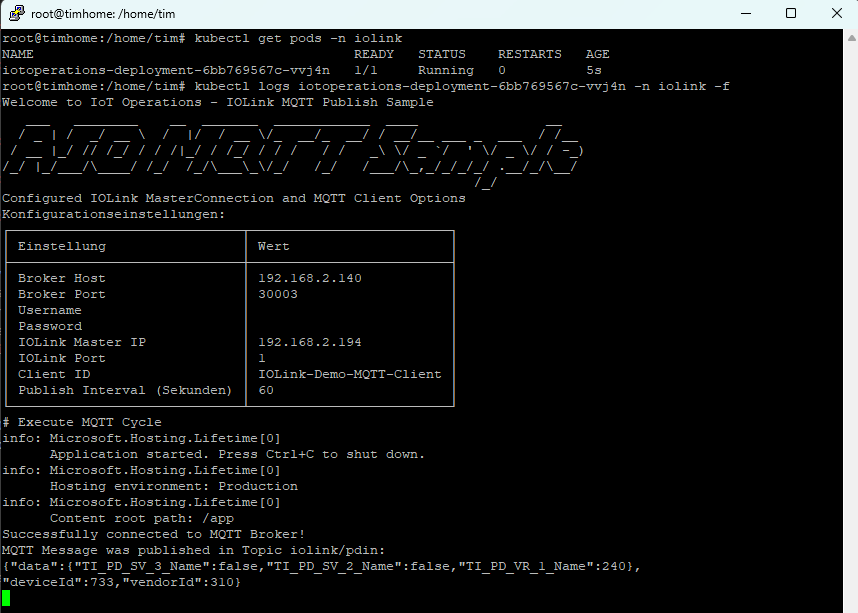

# IoT Operations Sample - IOLink.NET via MQTT

Dieses Repository dient als Beispiel, wie man **IOLink.NET** an den integrierten **IoT Operations MQTT Broker** anbindet. Die Anwendung läuft in einer Endlosschleife als **Container** und veröffentlicht die gelesenen Daten vom **IOLinkPortReader** über MQTT-Nachrichten im definierten Zeitintervall. Wenn kein IoT Operations zum Einsatz kommt, können die Daten auch an jeden anderen beliebigen MQTT Broker gesendet werden.

<p align="center">
  
</p>

## Architekturdiagramm


## Features

- Verbindung zu einem IO-Link Master mittels **IOLink.NET**
- Datenlesen mit **IOLinkPortReader**
- MQTT Client zur Veröffentlichung der Sensordaten
- Docker-Container für eine einfache Bereitstellung

## Voraussetzungen

- [.NET 8+](https://dotnet.microsoft.com/en-us/download/dotnet/8.0)
- [Docker](https://www.docker.com/products/docker-desktop/)
  - _Zum erstellen des Image_
  - _(Optional) lokales Ausführen des Containers_
- Einen [Azure Arc-fähiger Kubernetes Cluster](https://learn.microsoft.com/azure/azure-arc/kubernetes/overview) (wie beispielsweise [K3s](https://k3s.io/)).
  - _Folgen Sie dieser [Dokumentation](https://learn.microsoft.com/iot-operations/deploy-iot-ops/howto-prepare-cluster?tabs=ubuntu), um sicherzustellen, dass der Cluster bereit für IoT Operations ist_
- Einen MQTT Broker
  - _IoT Operations stellt einen MQTT Broker bereit, es ist möglich eine Verbindung zu einem beliebigen MQTT Broker herzustellen_
  - _Alternativ über einen dedizierten MQTT Broker z.B. Eclipse Mosquitto, HiveMQ, EMQX_
- IO-Link Master mit angeschlossenem Sensor
  - Im Beispiel ist der IO-Link Master im selben Netzwerk wie der Kubernetes Cluster

## Azure IoT Operations installieren

1. Stelle sicher, dass die neueste Azure CLI-Erweiterung installiert ist.

   ```sh
   az extension add --upgrade --name azure-iot-ops
   ```

2. Bereitstellung im Kubernetes-Cluster (Beispiel: für meinen Single-Node-Cluster).

   Falls du noch keinen Arc-enabled Kubernetes Cluster hast, kannst du [hier](https://iotim.de/kubernetes-cluster-mit-azure-arc-verbinden-mein-erfahrungsbericht/) nachlesen wie du einen einrichtest.

   Parameter:

   ```powershell
   $STORAGE_ACCOUNT=<Storage-Account-Name>
   $LOCATION=<Azure Location>
   $RESOURCE_GROUP=<Resource-Group-Name>
   $SCHEMA_REGISTRY=<SchemaRegistry-Name>
   $SCHEMA_REGISTRY_NAMESPACE=<SchemaRegistry-Namespace>
   $CLUSTER_NAME=<ClusterName>
   $SUBSCRIPTION_ID=<Azure Subscription-ID>
   $ACR_NAME=<Container-Registry-Name>
   ```

   Extensions einmalig auf dem Cluster aktivieren

   ```sh
   az provider register -n "Microsoft.ExtendedLocation"
   az provider register -n "Microsoft.Kubernetes"
   az provider register -n "Microsoft.KubernetesConfiguration"
   az provider register -n "Microsoft.IoTOperations"
   az provider register -n "Microsoft.DeviceRegistry"
   az provider register -n "Microsoft.SecretSyncController"
   ```

   Storage Account erstellen:

   ```sh
   az storage account create --name $STORAGE_ACCOUNT --location $LOCATION --resource-group $RESOURCE_GROUP --enable-hierarchical-namespace
   ```

   Schema Registry anlegen:

   ```sh
   az iot ops schema registry create --name $SCHEMA_REGISTRY --resource-group $RESOURCE_GROUP --registry-namespace $SCHEMA_REGISTRY_NAMESPACE --sa-resource-id $(az storage account show --name $STORAGE_ACCOUNT -o tsv --query id)
   ```

   IoT Operations Cluster initalisierung

   ```sh
   az iot ops init --cluster $CLUSTER_NAME --resource-group $RESOURCE_GROUP
   ```

   IoT Operations Cluster deployment

   ```sh
   az iot ops create --subscription $SUBSCRIPTION_ID \
   --cluster $CLUSTER_NAME \
   --resource-group $RESOURCE_GROUP \
   --name ${CLUSTER_NAME} \
   --sr-resource-id $(az iot ops schema registry show --name $SCHEMA_REGISTRY --resource-group $RESOURCE_GROUP -o tsv --query id) \
   --broker-frontend-replicas 1 \
   --broker-frontend-workers 1  \
   --broker-backend-part 1  \
   --broker-backend-workers 1 \
   --broker-backend-rf 2 \
   --broker-mem-profile Low \
   ```

3. Überprüfen Sie die Ausgabe der IoT Ops-Servicebereitstellung. Falls Sie IoT Ops bereits installiert haben, stellen Sie sicher, dass Sie zuerst **_auf Updates prüfen_**.

   ```sh
   az extension add --upgrade --name azure-iot-ops
   az iot ops check
   ```

   <p align="center">
   
   </p>

<!--4. OPTIONAL - Um die MQTT-Bridge zwischen dem IIoT Gateway und dem AIO MQTT Broker abzusichern, bereiten Sie Server- und Client-Zertifikate vor, die auf dem AIO MQTT Broker und dem IIoT Gateway installiert werden sollen. Weitere Informationen finden Sie im folgenden Tutorial: [Tutorial: Azure IoT Operations MQTT broker TLS, X.509 client authentication, and ABAC - Azure IoT Operations | Microsoft Learn](https://learn.microsoft.com/azure/iot-operations/manage-mqtt-broker/tutorial-tls-x509)

5. Erstellen Sie einen neuen Load Balancer Listener für den AIO MQTT Broker (mit dem im vorherigen Schritt erstellten Server-Zertifikat) auf Port 8883 mit ***X509-Authentifizierung***: [Secure MQTT broker communication by using BrokerListener - Azure IoT Operations | Microsoft Learn](https://learn.microsoft.com/azure/iot-operations/manage-mqtt-broker/howto-configure-brokerlistener?tabs=portal%2Ctest)-->

An diesem Punkt ist der AIO MQTT Broker einsatzbereit

## Deployment vorbereiten und auf Azure IoT Operations Cluster deployen

### 1. Repository klonen

```sh
git clone https://github.com/domdeger/iot-operations-iolink-drop.git
cd src
```

### 2. Image erstellen

```sh
docker compose build iotoperationsdrop.iolink
```

### 3. Image taggen

```sh
docker tag iotoperationsdrop.iolink myregistry.azurecr.io/iot/iotoperationsdrop.iolink:latest
```

### 4. Container in deine Azure Container Registry pushen

[Ausführliche Anleitung zum pushen in die ACR](https://learn.microsoft.com/en-us/azure/container-registry/container-registry-get-started-docker-cli?tabs=azure-cli)

```sh
az login
az acr login --name myregistry
docker push myregistry.azurecr.io/iot/iotoperationsdrop.iolink:latest
```

### 5. Kubernetes Cluster für Verwendung mit ACR vorbereiten

Falls du noch keine Azure Container Registry erstellt hast, findest du [hier für die Azure CLI](https://learn.microsoft.com/en-us/azure/container-registry/container-registry-get-started-azure-cli) und [hier für das Azure Portal](https://learn.microsoft.com/en-us/azure/container-registry/container-registry-get-started-portal?tabs=azure-cli) eine ausführliche Anleitung

#### 5.1 Service Principal mit Pull-Rechten erstellen

```sh
az ad sp create-for-rbac --name acr-service-principal --role acrpull --scopes /subscriptions/$SUBSCRIPTION_ID/resourceGroups/$CLUSTER_NAME/providers/Microsoft.ContainerRegistry/registries/$ACR_NAME
```

Die Antwort sieht exemplarisch wie folgt aus und wird beim anlegen des Secrets wieder benötigt:

```json
{
  "appId": "...",
  "displayName": "acr-service-principal",
  "password": "...",
  "tenant": "..."
}
```

Folgende Parameter sollten für die weiteren Schritte gesetzt werden:

```powershell
$SERVICE_PRINCIPAL_APPID=appId
$SERVICE_PRINCIPAL_PASSWORD=password
$DOCKER_MAIL=mymailadress
```

Wenn die IO-Link anbindung in einem eigenen Kubernetes Namespace, sodass die Anwendung isoliert läuft, erstellt werden soll muss dieser angelegt werden

```sh
kubectl create namespace iolink
```

#### 5.2 Secret Anlegen:

```sh
kubectl create secret docker-registry acr-secret \
  --docker-server=$ACR_NAME.azurecr.io \
  --docker-username=$SERVICE_PRINCIPAL_APPID \
  --docker-password=$SERVICE_PRINCIPAL_PASSWORD \
  --docker-email=$DOCKER_MAIL \
  --namespace=iolink
```

#### 5.3 Secret prüfen

```sh
kubectl get secret acr-secret --namespace=iolink -o yaml
```

#### 5.4 Deployment auf Kubernetes Cluster ausrollen

```yaml
apiVersion: apps/v1
kind: Deployment
metadata:
  name: iotoperations-deployment
  namespace: iolink
  labels:
    app: iolink-demo
spec:
  replicas: 1
  selector:
    matchLabels:
      app: iolink-demo
  template:
    metadata:
      labels:
        app: iolink-demo
    spec:
      imagePullSecrets:
        - name: acr-secret
      containers:
        - name: iotoperations-container
          image: myregistry.azurecr.io/iot/iotoperationsdrop.iolink:latest
          env:
            - name: IOLink__MasterIP
              value: '192.168.2.194'
            - name: IOLink__Port
              value: '1'
            - name: Mqtt__ClientId
              value: 'IOLink-Demo-MQTT-Client'
            - name: Mqtt__BrokerHost
              value: '192.168.2.140'
            - name: Mqtt__BrokerPort
              value: '30003'
            - name: Mqtt__Username
              value: ''
            - name: Mqtt__Password
              value: ''
            - name: Mqtt__PublishIntervalSeconds
              value: '60'
```

**&#128161;Achte darauf die Umgebungsvariablen anzupassen**  
Ersetze `IOLink__MasterIP.value` mit der IP-Adresse deines IO-Link Masters im Netzwerk  
Ersetze `IOLink__Port.value` mit dem Port an den dein IO-Link Gerät am Master angeschlossen ist  
Ersetze `Mqtt__BrokerHost.value` mit der IP-Adresse deines Kubernetes Clusters  
Ersetze `Mqtt__PublishIntervalSeconds` mit dem Zeitintervall in Sekunden in denen deine Nachrichten auf den MQTT Broker gelegt werden sollen

#### 5.5 Prüfen ob das Deployment erfolgreich war

Pods im Namespace iolink abrufen:

```sh
kubectl get pods -n iolink
```

Logs des Containers anzeigen:

```sh
kubectl logs podname -n iolink
```

<p align="center">
  
</p>

## MQTT Topics

Das Programm sendet periodisch die IO-Link Sensordaten an das im Beispiel verwendete MQTT-Topic. Beispiel:

```
topic: iolink/pdin
payload: {"data":{"TI_PD_SV_3_Name":false,"TI_PD_SV_2_Name":false,"TI_PD_VR_1_Name":243},"deviceId":733,"vendorId":310}
```

<p align="center">
  
</p>

## Entwicklung / Lokale Ausführung

Falls du den Code lokal ausführen möchtest

#### 1. Repository klonen

```sh
git clone https://github.com/domdeger/iot-operations-iolink-drop.git
cd iot-operations-iolink-drop
```

installiere die Abhängigkeiten mit:

```sh
dotnet restore
dotnet run
```

#### 2. Konfiguration

Passe die Datei `appsettings.json` an, um den **IO-Link Master** und den **MQTT Broker** zu konfigurieren:

```json
{
  "IOLink": {
    "MasterIP": "192.168.1.100",
    "Port": 1
  },
  "Mqtt": {
    "ClientId": "IOLink-Demo-MQTT-Client",
    "BrokerHost": "your-broker-address",
    "BrokerPort": 1883,
    "PublishIntervalSeconds": 60
  }
}
```

&#128161; Alternativ können die Konfigurationswerte durch Umgebungsvariablen nach folgendem Schema überschrieben werden Section**Value. Beispiel: IOLink**MasterIP

Vorlage:

```powershell
$IOLink__MasterIP=192.168.2.140
$IOLink__Port=1
$Mqtt__ClientId="IOLink-Demo-MQTT-Client"
$Mqtt__BrokerHost="your-broker-address"
$Mqtt__BrokerPort=1883
$Mqtt__PublishIntervalSeconds=60
```

#### 3. Container erstellen und starten

Container und lokalen MQTT Broker erstellen und starten

```sh
docker compose up --build -d
```

Nur die Beispielapplikation erstellen und starten

```sh
docker compose up iotoperationsdrop.iolink --build -d
```

### 4. Logs überprüfen

```sh
docker compose logs -f iotoperationsdrop.iolink
```

## Lizenz

Dieses Projekt steht unter der MIT-Lizenz. Siehe [LICENSE](LICENSE) für weitere Details.

## Autor

**Tim Steiner** – [GitHub Profil](https://github.com/tim1993)
**Dominik Deschner** – [GitHub Profil](https://github.com/domdeger)

---

**Hinweis:** Dies ist ein Beispiel-Repository für die Integration von IO-Link und MQTT mit .NET.
