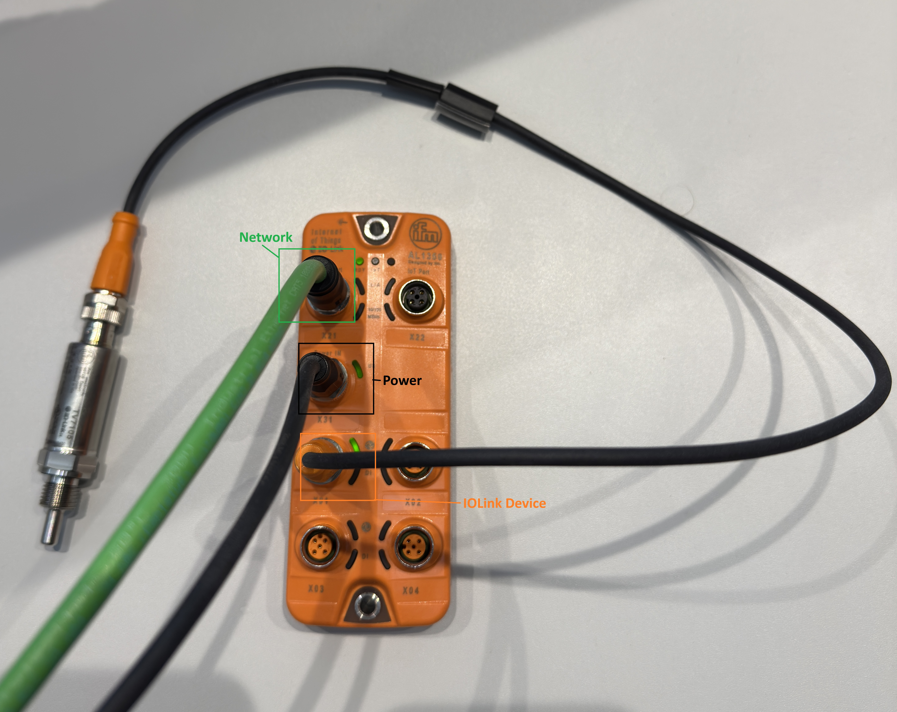
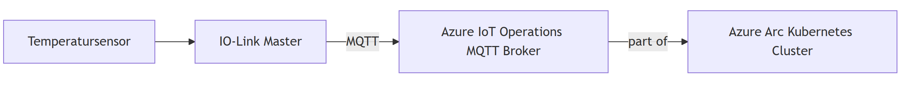
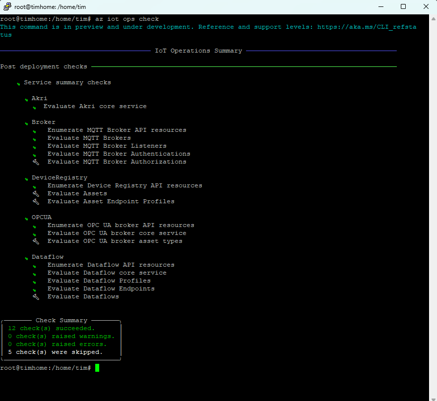
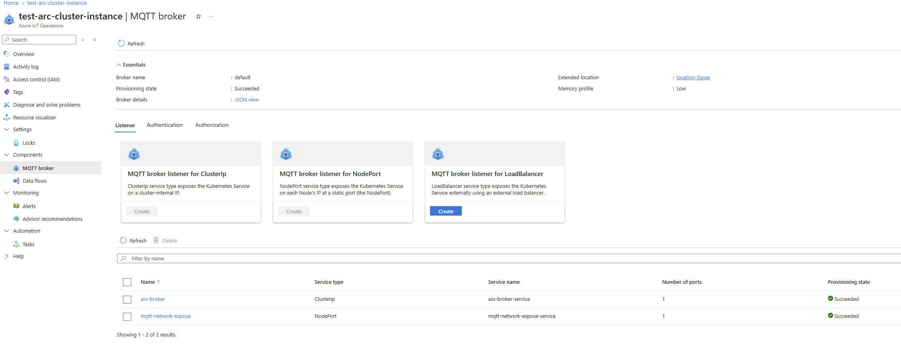
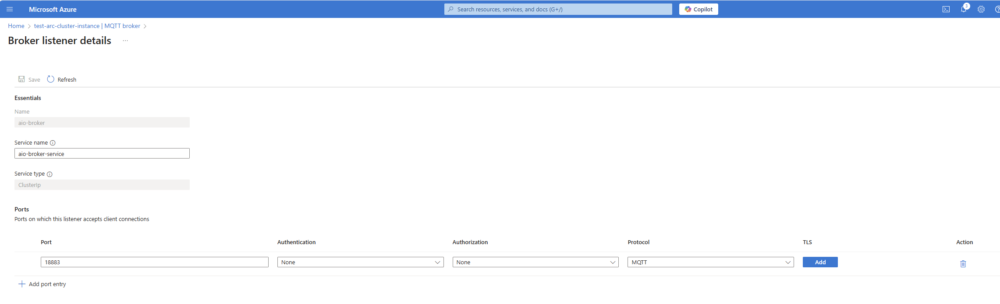
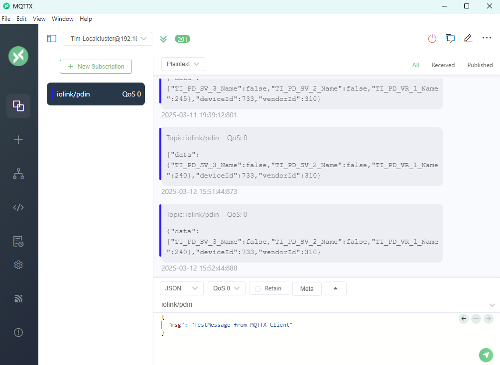

# IoT Operations Sample - IOLink.NET via MQTT

This repository serves as an example of how to connect **IOLink.NET** to the integrated **IoT Operations MQTT Broker**. The application runs in an endless loop as a **container** and publishes the data read from the **IOLinkPortReader** via MQTT messages at the defined time interval. If no IoT operations are used, the data can also be sent to any other MQTT broker.

<p align="center">
  
</p>

## Architecture diagram
<p align="center">
  
</p>

## Features
- Connection to an IO-Link master via **IOLink.NET**
- Data reading with **IOLinkPortReader**
- MQTT client for publishing the sensor data
- Docker container for easy deployment

## Requirements
- [.NET 8+](https://dotnet.microsoft.com/en-us/download/dotnet/8.0)
- [Docker](https://www.docker.com/products/docker-desktop/)  
  - *To create the image*
  - *(Optional) run the container locally*
- An [Azure Arc-enabled Kubernetes cluster](https://learn.microsoft.com/azure/azure-arc/kubernetes/overview) (such as [K3s](https://k3s.io/)).  
  - *Follow this [documentation](https://learn.microsoft.com/iot-operations/deploy-iot-ops/howto-prepare-cluster?tabs=ubuntu) to ensure the cluster is ready for IoT operations*
- An MQTT Broker  
  - IoT Operations provides an MQTT broker, it is possible to connect to any MQTT broker*
  - Alternatively via a dedicated MQTT broker e.g. Eclipse Mosquitto, HiveMQ, EMQX*
- IO-Link master with connected sensor
  - In the example, the IO-Link master is in the same network as the Kubernetes cluster


## Install Azure IoT Operations
1. make sure that the latest Azure CLI extension is installed.
   
   ```sh
   az extension add --upgrade --name azure-iot-ops
   ```

2. deployment in the Kubernetes cluster (example: for my single-node cluster).

   If you do not have an Arc-enabled Kubernetes cluster yet, you can read [here](https://iotim.de/kubernetes-cluster-mit-azure-arc-verbinden-mein-erfahrungsbericht/) how to set one up.

   Parameters: 
   ```sh 
   STORAGE_ACCOUNT=<Storage-Account-Name>  
   LOCATION=<Azure Location>  
   RESOURCE_GROUP=<resource group name>  
   SCHEMA_REGISTRY=<SchemaRegistry-Name>  
   SCHEMA_REGISTRY_NAMESPACE=<SchemaRegistry-Namespace>  
   CLUSTER_NAME=<ClusterName>  
   SUBSCRIPTION_ID=<Azure Subscription ID>  
   ACR_NAME=<Container Registry Name>
   ```

   Activate extensions once on the cluster
   ```sh
   az provider register -n "Microsoft.ExtendedLocation"
   az provider register -n "Microsoft.Kubernetes"
   az provider register -n "Microsoft.KubernetesConfiguration"
   az provider register -n "Microsoft.IoTOperations"
   az provider register -n "Microsoft.DeviceRegistry"
   az provider register -n "Microsoft.SecretSyncController"
   ```

   Create storage account:
   ```sh
   az storage account create --name $STORAGE_ACCOUNT --location $LOCATION --resource-group $RESOURCE_GROUP --enable-hierarchical-namespace
   ```

   Create schema registry:
   ```sh
   az iot ops schema registry create --name $SCHEMA_REGISTRY --resource-group $RESOURCE_GROUP --registry-namespace $SCHEMA_REGISTRY_NAMESPACE --sa-resource-id $(az storage account show --name $STORAGE_ACCOUNT -o tsv --query id)
   ```

   IoT Operations Cluster initialization
   ```sh
   az iot ops init --cluster $CLUSTER_NAME --resource-group $RESOURCE_GROUP
   ```
   
   IoT Operations Cluster deployment
   ```sh
   az iot ops create --subscription $SUBSCRIPTION_ID \
   --cluster $CLUSTER_NAME \
   --resource-group $RESOURCE_GROUP \
   --name ${CLUSTER_NAME} \
   --sr-resource-id $(az iot ops schema registry show --name $SCHEMA_REGISTRY --resource-group $RESOURCE_GROUP -o tsv --query id) \
   --broker-frontend-replicas 1 \
   --broker-frontend-workers 1 \
   --broker-backend-part 1 \
   --broker-backend-workers 1 \ \
   --broker-backend-rf 2 \ \
   --broker-mem-profile Low \
   ```

3. check the output of the IoT Ops service deployment. If you have already installed IoT Ops, make sure you ***check for updates*** first.
   
   ```sh
   az extension add --upgrade --name azure-iot-ops
   az iot ops check
   ```
   
   <p align="center">
   
   </p>

4. Setup of MQTT Broker  
Navigate to your Azure IoT Operations Cluster Instance and delete the default MQTT broker.
For easy of use we create a new internal broker listener for ClusterIp without authentication and without TLS.

   <p align="center">
   
   </p>
   <p align="center">
   
   </p>

    **!!!ATTENTION!!!** Do not use this setup without TLS and Authentication for production ready environments! For secure connections follow the next two steps!  
  
5. In order to secure the MQTT bridge between the IO-Link Sample App and AIO MQTT Broker, prepare **server and client certificates** to be installed on the AIO MQTT broker and IIoT Gateway by following: [Tutorial: Azure IoT Operations MQTT broker TLS, X.509 client authentication, and ABAC - Azure IoT Operations | Microsoft Learn](https://learn.microsoft.com/azure/iot-operations/manage-mqtt-broker/tutorial-tls-x509)  
  
6. Create a new AIO MQTT Broker Load Balancer listener (with the server certificate created in the previous step) on **port 8883** with **X509-auth**: [Secure MQTT broker communication by using BrokerListener - Azure IoT Operations | Microsoft Learn](https://learn.microsoft.com/azure/iot-operations/manage-mqtt-broker/howto-configure-brokerlistener?tabs=portal%2Ctest)  
  
At this point, the AIO MQTT Broker is ready for use  

## Prepare deployment and deploy to Azure IoT Operations Cluster

### 1. clone repository
```sh
git clone https://github.com/domdeger/iot-operations-iolink-drop.git
cd src
```

### 2. create image
```sh
docker compose build iotoperationsdrop.iolink
```

### 3. tag the image
```sh
docker tag iotoperationsdrop.iolink myregistry.azurecr.io/iot/iotoperationsdrop.iolink:latest
```

### 4. push containers into your Azure Container Registry
[Detailed instructions for pushing to the ACR](https://learn.microsoft.com/en-us/azure/container-registry/container-registry-get-started-docker-cli?tabs=azure-cli)
```sh
az login
az acr login --name myregistry
docker push myregistry.azurecr.io/iot/iotoperationsdrop.iolink:latest
```

### 5. prepare Kubernetes cluster for use with ACR
If you have not yet created an Azure Container Registry, you can find detailed instructions [here for the Azure CLI](https://learn.microsoft.com/en-us/azure/container-registry/container-registry-get-started-azure-cli) and [here for the Azure Portal](https://learn.microsoft.com/en-us/azure/container-registry/container-registry-get-started-portal?tabs=azure-cli)  

#### 5.1 Create service principal with pull rights
```sh
az ad sp create-for-rbac --name acr-service-principal --role acrpull --scopes /subscriptions/$SUBSCRIPTION_ID/resourceGroups/$CLUSTER_NAME/providers/Microsoft.ContainerRegistry/registries/$ACR_NAME
```
The response looks as follows as an example and is required again when the secret is created:
```json
{
  "appId": "...",
  "displayName": "acr-service-principal",
  "password": "...",
  "tenant": "..."
}
```

The following parameters should be set for the next steps:
```sh
SERVICE_PRINCIPAL_APPID=appId
SERVICE_PRINCIPAL_PASSWORD=password
DOCKER_MAIL=mymailadress
```

If the IO-Link connection is to be created in a separate Kubernetes namespace so that the application runs in isolation, this must be created
```sh
kubectl create namespace iolink
```

#### 5.2 Create secret:
```sh
kubectl create secret docker-registry acr-secret \
  --docker-server=$ACR_NAME.azurecr.io \
  --docker-username=$SERVICE_PRINCIPAL_APPID \
  --docker-password=$SERVICE_PRINCIPAL_PASSWORD \
  --docker-email=$DOCKER_MAIL \
  --namespace=iolink
```


#### 5.3 Check secret
```sh
kubectl get secret acr-secret --namespace=iolink -o yaml
```

#### 5.4 Roll out deployment to Kubernetes cluster
```yaml
apiVersion: apps/v1
kind: Deployment
metadata:
  name: iotoperations-deployment
  namespace: iolink
  labels:
    app: iolink-demo
spec:
  replicas: 1
  selector:
    matchLabels:
      app: iolink-demo
  template:
    metadata:
      labels:
        app: iolink-demo
    spec:
      imagePullSecrets:
        - name: acr-secret
      containers:
        - name: iotoperations-container
          image: myregistry.azurecr.io/iot/iotoperationsdrop.iolink:latest
          env:
            - name: IOLink__MasterIP
              value: "192.168.2.194"
            - name: IOLink__Port
              value: "1"
            - name: Mqtt__ClientId
              value: "IOLink-Demo-MQTT-Client"
            - name: Mqtt__BrokerHost
              value: "aio-broker-service.azure-iot-operations.svc.cluster.local"
            - name: Mqtt__BrokerPort
              value: "18883"
            - name: Mqtt__Username
              value: ""
            - name: Mqtt__Password
              value: ""
            - name: Mqtt__PublishIntervalSeconds
              value: "60"
```

**!!!ATTENTION!!!** Be sure to adjust the environment variables**  
  
Replace `IOLink__MasterIP.value` with the IP address of your IO-Link master in the network  
  
Replace `IOLink__Port.value` with the port to which your IO-Link device is connected to the master  
  
Replace `Mqtt__BrokerHost.value` according to your configuration (aio-broker-service references to the service name of your MQTT Broker listener details)  
  
Replace `Mqtt__PublishIntervalSeconds` with the time interval in seconds in which your messages should be placed on the MQTT broker

#### 5.5 Check whether the deployment was successful
Retrieve pods in the namespace iolink:
```sh
kubectl get pods -n iolink
```

Display logs of the container:
```sh
kubectl logs podname -n iolink
```
<p align="center">
  
</p>

## MQTT Topics
The program periodically sends the IO-Link sensor data to the MQTT topic used in the example. Example:

```
topic: iolink/pdin
payload: {"data":{"TI_PD_SV_3_Name":false,"TI_PD_SV_2_Name":false,"TI_PD_VR_1_Name":243},"deviceId":733,"vendorId":310}
```
<p align="center">
  
</p>

## Development / Local execution
If you want to run the code locally

#### 1. clone repository
```sh
git clone https://github.com/domdeger/iot-operations-iolink-drop.git
cd iot-operations-iolink-drop
```

install the dependencies with:
```sh
dotnet restore
dotnet run
```

#### 2. configuration
Customize the file `appsettings.json` to configure the **IO-Link Master** and the **MQTT Broker**:

```json
{
  "IOLink": {
    "MasterIP": "192.168.1.100",
    "Port": 1
  },
  "Mqtt": {
    "ClientId": "IOLink-Demo-MQTT-Client",
    "BrokerHost": "your-broker-address",
    "BrokerPort": 1883,
    "PublishIntervalSeconds": 60
  }
}
```
&#128161; Alternatively, the configuration values can be overwritten by environment variables according to the following scheme Section__Value. Example: IOLink__MasterIP

Template:
```sh
IOLink__MasterIP=192.168.2.140
IOLink__Port=1
Mqtt__ClientId="IOLink-Demo-MQTT-Client"
Mqtt__BrokerHost="your-broker-address"
Mqtt__BrokerPort=1883
Mqtt__PublishIntervalSeconds=60
```

#### 3. Create and start container

Create and start container and local MQTT broker
```sh
docker compose up --build -d
```

Create and start only the sample application
```sh
docker compose up iotoperationsdrop.iolink --build -d
```

### 4. check logs

```sh
docker compose logs -f iotoperationsdrop.iolink
```

## License
This project is licensed under the MIT license. See [LICENSE](LICENSE) for more details.

## Author
**Tim Steiner** - [GitHub profile](https://github.com/tim1993)  
**Dominik Deschner** - [GitHub profile](https://github.com/domdeger)

---
**Note:** This is an example repository for the integration of IO-Link and MQTT with .NET.

